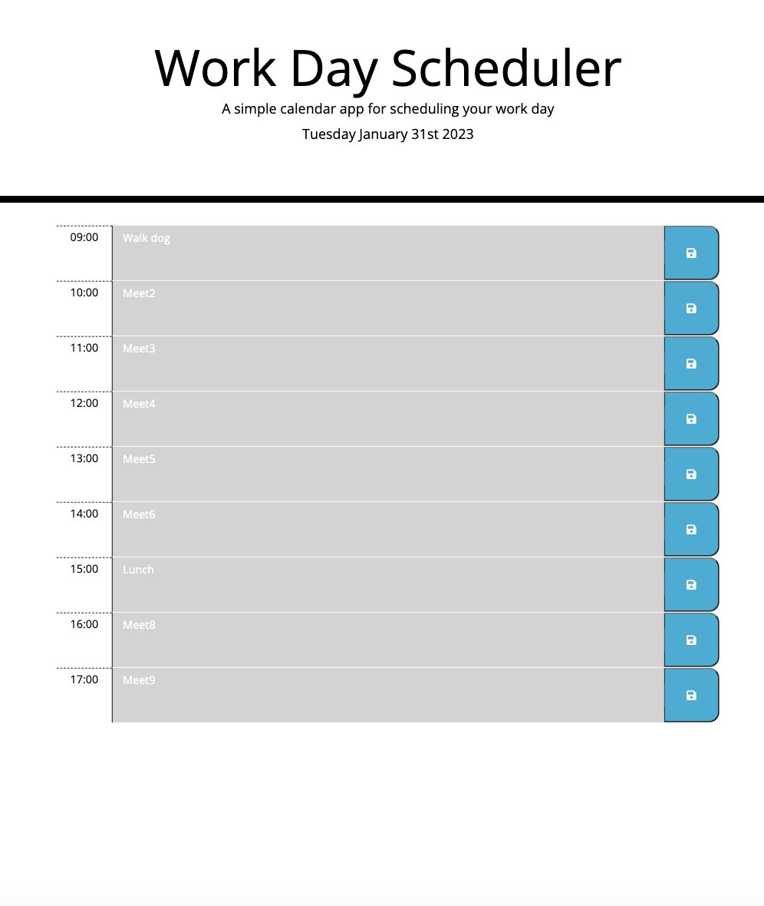

# daily-planner-app
A simple calendar application that allows a user to save events for each hour of the day.

## User Story
AS AN employee with a busy schedule
I WANT to add important events to a daily planner
SO THAT I can manage my time effectively

## Acceptance Criteria
The app should:

Display the current day at the top of the calendar when a user opens the planner.
Present timeblocks for standard business hours when the user scrolls down.
Color-code each timeblock based on past, present, and future when the timeblock is viewed.
Allow a user to enter an event when they click a timeblock.
Save the event in local storage when the save button is clicked in that timeblock.
Persist events between refreshes of a page.

## Method
1. Add rows to the time-block
2. Add an id to each row for navigating/calling in Javascript and Local Storage later
3. Adjust the column spacing
4. Add the save button and save icon
5. Use Moment.js to retrieve current date and add to header
6. Define the function to set the time-block colour
7. Assign past, present and future classes depending on the current hour
8. When save button is clicked, save event in local storage
9. Add get item to fetch the event if it exists in local storage

